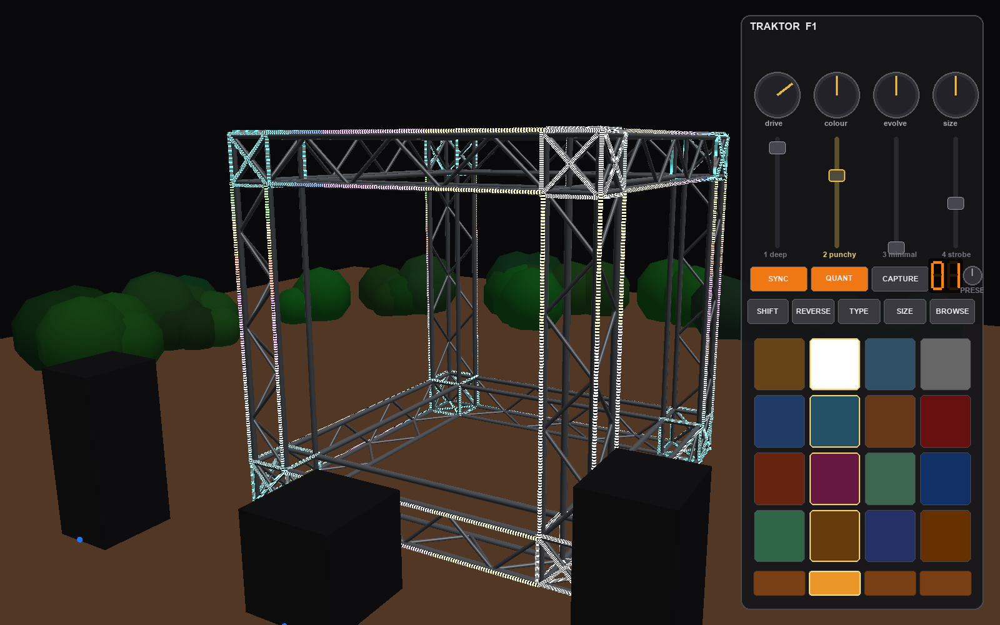

# Cube Dance

Sound-reactive LED control software and 3D simulation for a **2.6 m F34 truss cube**
used at dance-music events. The lights are primarily sound-reactive and evolve over time;
downstream mapping software (MadMapper) drives the physical pixels.



*The simulator running: rainbow spectrum beams and bass-lit corners on the truss cube, with
the on-screen Traktor Kontrol F1 (press `C`) driving the 4-deck preset mixer.*

This repo is built **spec-first** with [OpenSpec](https://github.com/Fission-AI/OpenSpec)
and developed in **phases** — see [`openspec/project.md`](openspec/project.md) for the
full roadmap and the physical cube facts.

## Status: Phase 6 — live audio input

Drive the whole show off **real-time sound** (the DJ's output / a line-in / a mic) instead of
a file — the analysis was streaming from day one, so the live input drops in behind the same
window-at-the-playhead contract.

```bash
uv run cube-dance --list-audio-inputs                 # see your input devices
uv run cube-dance --live                               # default input
uv run cube-dance --live --input-device "Volt"         # pick a device (name or index)
uv run cube-dance --live --input-gain 1.5              # boost a quiet line
```

- Captures into a rolling ring buffer on a background thread (non-blocking; degrades to
  silence if no device). Presented as **stereo** (mono inputs are duplicated) so the L/R
  features work. The HUD shows a **LIVE** indicator and elapsed time — no transport (you
  can't seek a live feed), and it never "ends".
- On macOS the first run may ask for **microphone permission**; a virtual loopback (e.g.
  *Background Music*) or an interface input (e.g. *Volt*) captures the music without a mic.
- Recording (`V`) in live mode is **video-only** for now (no file to mux).

## Status: Phase 5 — the F1 as a performance instrument

The F1 becomes the live instrument. The default visual is a **4-deck mixer**: a preset
"plays" on each channel and **the fader is that channel's volume** — blend presets live like
a VJ mixer, then perform on top with per-channel pad triggers and per-preset knobs.

- **Faders = channel volumes.** Channels 1–4 default to `deep`, `punchy`, `minimal`,
  `strobe` (only channel 1 up at launch). Push a fader to fade its preset in.
- **Ten presets to load on any channel.** The four mixer-friendly ones above, plus six
  wilder, stylistically distinct ones: **`inferno`** (a flickering fire, hot at the base),
  **`matrix`** (green digital rain falling down the cube), **`plasma`** (a smooth flowing
  psychedelic colour field), **`siren`** (hard red/blue half-cube alarm strobe), **`spiral`**
  (a 3-D double helix that grows 0→100% via the `density` knob, with the helices' crossings
  glowing white), and **`vortex`** (a black hole: hard stark spiral arms rotating around an
  empty core, random orientation each launch).
- **Distinct pad triggers per program.** Each preset defines its own four pad triggers from a
  varied vocabulary — coloured stabs, **shockwaves**, **comets**, **lightning**, **wipes**,
  **confetti**, risers, sparkles — so every channel's pads do something genuinely different.
- **Knob soft-takeover.** Each channel keeps its own knob values; switching channels never
  jumps a param. A knob re-takes control only once you turn it *through* the channel's stored
  value (the panel shows a blue pick-up dot and ghosts the needle until it engages) — so it
  behaves correctly on a real F1 whose knobs can't move.
- **Pads = per-channel triggers, coloured by the preset.** Each **column is a channel**; its
  4 pads are that preset's triggers (a stab, a build/riser, a strobe, a sparkle…), each a
  bit of **arbitrary preset code** with a **colour annotation**. Hit a pad to fire it.
- **Knobs = the selected channel's preset params** (e.g. `deep`'s *bright / colour / evolve /
  width*), with the preset's labels + defaults.
- **Channel select + preset.** Click a **bottom-row** button to select that channel, then
  **drag (or scroll) the browse encoder** to cycle its preset (shown on the 7-seg display);
  `N` cycles it too.
- **`QUANT`** snaps pad triggers to the beat; **`SYNC`** pulses the whole rig on the beat;
  **`TYPE`** mono/stark, **`SHIFT`** freeze, **`REVERSE`** reverse drift, **`SIZE`** fatten,
  **`CAPTURE`** blackout, **`BROWSE`** reset the channel's knobs.

```bash
uv run cube-dance --audio track.wav     # C for the F1; faders mix, pads trigger, knobs shape
```

<details>
<summary><b>Full F1 control map</b> (click to expand)</summary>

| Control | Role |
| --- | --- |
| **Fader 1–4** | Channel/deck **volume** — fade each preset in/out of the blend. |
| **Pads (4×4)** | **Column = channel**, the 4 rows are that preset's **triggers**. Each trigger is preset code that spawns a transient effect (stab / strobe / riser / sparkle / …); the pad shows the trigger's **colour**. Hit to fire (quantised when `QUANT` is on). |
| **Knob 1–4** | The **selected** channel's preset **params**: `intensity`, `hue/colour`, `evolve` (drift speed), `space`/size. Labels + defaults come from the preset. |
| **Bottom row 1–4** | **Channel select** — pick which channel the knobs + encoder act on (lit = selected). |
| **Browse encoder + display** | Cycle the **selected channel's preset**; the 7-seg shows its index. (`N` on the keyboard does the same.) |
| **QUANT** | Quantise pad triggers to the detected beat (fires on the next beat, ≤0.6 s fallback). |
| **SYNC** | Pulse the whole rig brighter on each detected kick. |
| **TYPE** | Mono / stark — render desaturated (white). |
| **SHIFT** | Freeze the evolving palette. |
| **REVERSE** | Reverse the colour-drift direction. |
| **SIZE** | Fatten moving / sparkle elements. |
| **CAPTURE** | Blackout (kill output). |
| **BROWSE** | Reset the selected channel's knobs to the preset defaults. |

A real F1 over MIDI feeds the same state (CC → knobs/faders, notes 0–15 → pads, others →
buttons); exact numbers depend on your Controller-Editor mapping.

**Authoring a preset's surface** — a preset module declares its knobs and pad triggers
(arbitrary factories that return a transient `Element`):

```python
from ..visuals.engine.element import Knob, Trigger
from ..visuals.engine.elements import ColorStab, RiserSweep

KNOBS = [Knob("bright", "intensity", 0.6), Knob("colour", "hue", 0.5),
         Knob("evolve", "speed", 0.35), Knob("width", "space", 0.5)]

TRIGGERS = [
    Trigger("stab",  (255, 170, 60), lambda m, s, c: ColorStab(m, c, gain=s, release=0.35)),
    Trigger("build", (255, 90, 40),  lambda m, s, c: RiserSweep(m, c, dur=1.6, gain=0.9 * s)),
]
```

</details>

## Status: Phase 4 — evolving visual engine (event-driven, preset-authored)

The default `spectrum` visual is now a **layered element engine** fed by **classified
musical events**, not just raw bands:

- **Event detection** (streaming, heuristic): per-band spectral-flux onsets → classify
  **kick / hat / snare / perc**; sustained bass stays the continuous stream (kick-vs-bass by
  attack). Rough tempo/beat phase.
- **Elements** subscribe to events + features and composite: `BassCorners`, `SpectrumBeams`,
  `KickPulse`, `HatSparkle`, `Sweep`, `Chase`, `AmbientWash`, with LFO/envelope/evolver
  modulators.
- **Evolution + composition awareness**: energy/onset-density tracking + an **accelerating**
  hue drift so a set keeps changing.
- **Python presets** author the look: `presets/<name>.py` with `build(engine)`. Pick with
  `--preset deep|punchy`; press **`N`** to cycle live.

```bash
uv run cube-dance --audio track.wav --preset punchy   # then N to cycle presets
```

## Status: Phase 3 — F1 control

Press **`C`** for an on-screen **Traktor Kontrol F1** in the right quarter (mouse is freed
and camera movement freezes while it's up). Its **knobs and faders are click-drag** (VST
style), **buttons are grey and light when clicked**, a **7-segment display** shows the
focused deck's preset, and the **browse encoder** (scroll over it) changes it. The control
roles are defined in **Phase 5** above (faders = deck volumes, knobs = global modulators).
A connected real F1 feeds the same controls over MIDI (best-effort).

## Status: Phase 2 — cube-aware, dynamic & stereo

Load an audio file (or the built-in demo beat) and the cube reacts **spatially and
musically**:

- **Corners ← bass**, split **left/right** by stereo channel.
- **Beams ← the spectrum**: frequency runs *along* each beam (low→high), and beams
  **lateralise by stereo** — content panned left lights the left beams, right the right.
- **Dynamic auto-levelling**: each band adapts to the track (so any mix looks good) while
  **quiet passages exponentially hide** and loud ones pop. Analysis is **streaming** (a
  short window at the playhead — no precompute, instant load, and ready for live input).
- **Colours evolve and accelerate** over a set, per frequency.

Audio plays out loud, synced to the visuals; the device opens in the background so the
window appears instantly. With no audio it falls back to the Phase 0 placeholder.

```bash
uv run cube-dance --demo                       # synthetic beat, no file needed
uv run cube-dance --audio track.wav            # your own file (WAV/FLAC/AIFF/OGG)
uv run cube-dance --audio track.wav --visual vu    # the simple Phase-1 VU meter instead
uv run cube-dance --audio track.wav --mute     # visuals only, no sound
```

`--visual`: `auto` (default — cube-aware "spectrum" with audio), `spectrum`, or `vu`.
Transport: **`K`** play/pause · **`J`** restart (shown in the on-screen help).

### Record a clip to share

Press **`V`** to start/stop recording (or pass `--record` to start at launch and stop on
quit). It captures the live window — your camera moves and all — to a **Facebook-ready
MP4** (H.264 + AAC, `+faststart`) and muxes the audio that played. The on-screen help/REC
overlay is **not** in the clip. Files land in `recordings/cube-<timestamp>.mp4`.

```bash
uv run cube-dance --demo --record           # auto-record from launch
uv run cube-dance --audio track.wav         # then press V to start/stop
uv run cube-dance --demo --record-fps 60 --record-dir ~/Desktop
```

The audio is muxed even with `--mute` (so the clip has sound); with no audio source the
clip is video-only. Needs `ffmpeg` (uses your system one, or the bundled `imageio-ffmpeg`).

### The cube (Phase 0 foundation)

An explorable native 3D simulation of the cube with a dense, abstract LED representation:

- **12 edge beams**, each lit with **2 rows per visible face** (the truss chords) — so
  top/vertical edges show ~3 parallel rows; the **base edges** light only their outward
  vertical face (ground-/up-facing rows are skipped, as they'd be invisible or stepped on).
- **8 corner cubes** lit on their **edges** (the glowing ⊠ outline) plus **X-panels** —
  denser, and a deliberate visual feature.
- A **dull-aluminium F34 truss** beneath the LEDs — the 4 chords per beam (the LED rows
  sit on them), diagonal lacing (the triangles) on the visible faces, and corner-cube
  frames. Shaded as metal that reacts to light. Toggle with `--no-truss`.
- Optional **scenery** for realism: a **clay ground**, surrounding **bushes** (it's a
  bush doof), and rough **speaker** cabinets (one sub front-centre, two mains in the same
  plane) with little **blue marker LEDs** at their base. Toggle with `--no-floor` /
  `--no-speakers` / `--no-bushes`.
- A single `(N, 3)` RGB **color buffer** is the hand-off contract every later phase writes.
- A placeholder, non-audio test pattern (edge sweep + corner pulse) animates the buffer
  so you can see the pixels light up. (Phase 1 replaces it with audio.)

~9,700 LED pixels at default density; renders as a glowing truss cube on a stage.

## Requirements

- **Python 3.12+** and [**uv**](https://docs.astral.sh/uv/).
- A desktop GPU. On macOS it uses OpenGL 4.1 (via Metal) through the **glfw** backend.

## Run

```bash
uv run cube-dance              # launch the interactive viewer
uv run cube-dance --selftest   # headless data-path check (no window)
```

Options:

```bash
uv run cube-dance --edge-density 144 --corner-density 200   # denser LEDs
uv run cube-dance --no-floor --no-speakers --no-bushes      # hide scenery
```

### Navigating the scene

There are **two navigation modes** — press **`Tab`** to switch. The active mode and its
controls are always shown in the on-screen help (toggle with **`H`**).

**Fly mode** (like an FPS) — **default** (the mouse is captured for look; press `Tab` for
orbit):

| Input            | Action            |
| ---------------- | ----------------- |
| Mouse            | look              |
| `W` `A` `S` `D`  | move              |
| `Space` / `E`    | up                |
| `Ctrl` / `Q`     | down              |
| `Shift` (hold)   | move faster       |
| Scroll           | adjust move speed |

**Orbit mode** (like a 3D editor / Blender) — press `Tab` to enter:

| Input                           | Action |
| ------------------------------- | ------ |
| Left-drag                       | orbit around the cube |
| Shift-drag / right- or mid-drag | pan    |
| Scroll                          | zoom   |

**Always available:** `R` reset view · `V` record clip · `C` F1 controls · `N` cycle the
focused deck's preset · `H` toggle help · `Esc` quit.
With audio: `K` play/pause · `J` restart. With no audio: `P` pause/resume the placeholder
pattern.

moderngl-window flags pass through, e.g. `uv run cube-dance --window glfw --vsync True`.

## Develop

```bash
uv run pytest        # unit tests + offscreen GPU render test (skips if no GL)
```

### Layout

```
cube_dance/
  config.py         CubeConfig — dimensions (from the SCAD), densities, scenery toggles
  geometry.py       12 edges (beam chords) + 8 corner cubes, deterministic ordering
  led_topology.py   dense LED pixels, addressing, regions -> CubeModel + color buffer
  patterns.py       placeholder test pattern (no-audio fallback)
  scenery.py        clay ground + bushes + speaker cabinets (non-LED realism props)
  truss.py          F34 truss tubes (chords + lacing + corner frames) for the metal pass
  led_mesh.py       emissive LED-strip tubes (one per run), coloured per-pixel from a texture
  audio/            file decode + live input (ring buffer), streaming analyzer + AGC,
                    event detection, transport — all behind one window_at(t, win) contract
  visuals/          VU + placeholder + params; engine/ (elements, evolution, deck mixer)
  presets/          Python presets: build(engine) + KNOBS/TRIGGERS (10: deep, punchy,
                    minimal, strobe, inferno, matrix, plasma, siren, spiral, vortex)
  control/          F1 control state, control->param mapping, basic MIDI input
  render/virtual_f1.py   interactive on-screen F1 panel (knobs/faders/buttons/display/pads)
  recording.py      live-session capture -> shareable MP4 (ffmpeg)
  render/camera.py  orbit + fly cameras (numpy matrices)
  render/scene.py   moderngl: LED points (single draw) + scenery, depth-correct
  render/hud.py     on-screen help overlay (Pillow text -> texture)
  app.py            moderngl-window viewer (render loop, dual nav modes, input, recording)
  selftest.py       headless data-path validation
  cli.py            entrypoint (cube-dance / python -m cube_dance)
reference/whole_cube.scad   the source-of-truth OpenSCAD model
openspec/                   specs, project context, and per-phase change proposals
```

### OpenSpec workflow

Each phase is one change under `openspec/changes/`. Capabilities live in
`openspec/specs/` and accrete as changes are archived. The OpenSpec CLI needs Node ≥ 18:

```bash
openspec list                          # active changes
openspec validate <change> --strict    # validate a change
openspec show <change>                 # view proposal/specs/tasks
```
