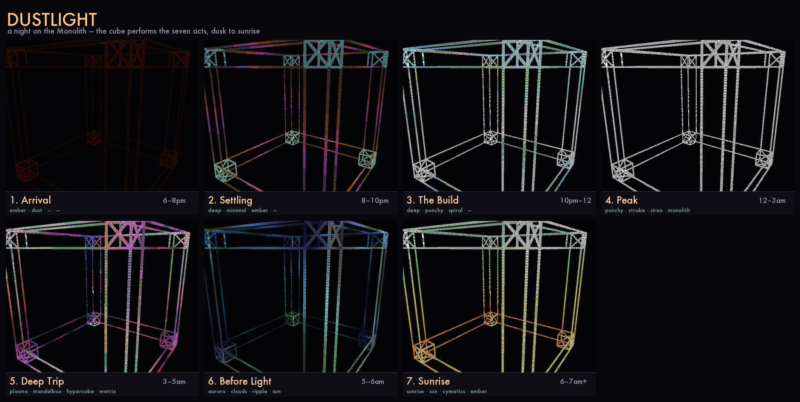

# DUSTLIGHT — a rave built around the cube

> *A bush doof where the 2.6 m truss cube is the fire everyone gathers around — a Monolith
> that breathes with the night and bursts into the dawn. This is the concept, and the **visual
> score** the cube performs from dusk to sunrise.*



> The seven acts, rendered from the real show director (`tools/render_storyboard.py`): dim warm
> **Arrival**, the floor **Settling**, **The Build** climbing, the cool relentless **Peak**, the
> psychedelic **Deep Trip**, the soft **Before Light**, and the gold **Sunrise**.

The simulator's world is already a clearing in the bush: clay ground, low scrub, a sub
front-centre with two mains flanking it, a glowing truss cube in the middle. DUSTLIGHT takes
that literally — an underground one-nighter in the Australian bush, and the cube ("the
Monolith") is the altar, the lighthouse, the thing 600 people face all night.

---

## The place

An hour and a half past the last town, then a locked gate, then 6 km of corrugated dirt
track you take at 20 km/h with your hazards on. The clearing is an old cleared paddock ringed
by **ironbark and stringybark gums**, a dry creek along one edge, red dust that gets into
everything and turns gold in any light. No reception. The location pin dropped in a Signal
group at 4 p.m., "no pin no entry." A hand-painted sign at the gate: *DUSTLIGHT — leave it
better than you found it.*

The rig is modest and loved: a stack of scoops and a single 18" sub dug slightly into the
earth so the bass goes *through* you, two mains on scaffold either side. And dead-centre,
raised on a low ironbark deck, the **Monolith** — the 2.6 m F34 truss cube, ~9,700 pixels of
emissive LED, the only engineered light for 40 km. By midnight it's the brightest object under
the Milky Way and you can see the dust hanging in its beams.

## The night (the arc)

It runs **dusk Friday to mid-morning Saturday**, ~13 hours, one continuous build-and-release.
The cube is operated from a Traktor F1 at the side of the deck — sometimes the DJ, sometimes
whoever's lucid and trusted. Seven acts:

| # | Act | ~Time | Music | Crowd | The Monolith |
|---|-----|-------|-------|-------|--------------|
| 1 | **Arrival** | 6–8pm | organic / downtempo / dub | tents going up, first hugs, golden hour | a low warm **ember**, barely breathing |
| 2 | **Settling** | 8–10pm | deep house, dub techno | the floor finds itself | bass corners + soft spectrum, slow sweeps |
| 3 | **The Build** | 10pm–12 | rolling / progressive techno | shoulders drop, eyes close | spectrum climbs, risers, decks layering, hue accelerating |
| 4 | **Peak** | 12–3am | driving techno → psytrance | full lock-in, dust in the lights, hands up | **punchy + strobe + the black-hole vortex**; blinders on the drops |
| 5 | **Deep Trip** | 3–5am | hypnotic, psychedelic, rolling | deep, internal, eyes-closed sway | **plasma, spiral, mandelbox, matrix, hypercube** — the mind-melt |
| 6 | **Before Light** | 5–6am | melodic, emotional, breakbeat | the indigo hour, someone crying happy | **aurora + clouds + first sun + ripples**, soft and huge |
| 7 | **Sunrise** | 6–7am+ | euphoric → ambient release | survivors facing east, arms open | **sunrise bloom** matched to the real dawn, then a morning ember |

The whole point: the cube isn't *reacting* to a track in isolation — it's living the **shape of
the night**. Quiet and warm when people are arriving; relentless and strobing at 2 a.m.;
fracturing into fractals at the deepest hour; and then, exactly as the sky goes from indigo to
rose to gold, the cube **glows the same colours back at the sun** and the field roars.

## The people (a few of them)

- **Macca**, 47, ran sound systems since the '90s, dug the sub in himself, watches the cube
  from behind the decks with his arms crossed and a tiny smile.
- **Priya & Jules**, late 20s, drove 9 hours, matching dust-caked boots, will be the last two
  dancing at the cube at sunrise.
- **the chai tent crew**, who never see the peak because they're holding court by the fire,
  but come out at first light.
- **a teenager on their first doof**, who lies on the deck under the cube at 4 a.m. and watches
  the hypercube fold through itself and decides this is the rest of their life.
- **the quiet ones in the chill space** under a tarp strung between two gums, where the cube is
  a soft pulse through the canvas.

No phones out (there's no signal anyway). Face paint, op-shop fur, a kid's glow bracelet
someone found. Deeply present, communal, a little feral, very kind.

---

## The visual score (what we build)

The cube performs the seven acts as a **show** — a director that crossfades the four mixer
decks through the night, riding intensity and palette, so it can run the whole arc on its own
(and a human can still grab the F1 and steer). New signature presets fill the gaps the 52
didn't cover; everything else is curated from the library.

**New presets for DUSTLIGHT**
- **`ember`** — the Monolith at rest: a warm, low, slowly-breathing body (Act 1 & the morning).
- **`dust`** — embers/fireflies drifting *upward* through the cube, twinkling (the bush at
  night; chill moments).
- **`monolith`** — a heavy, imposing peak presence: a deep bass body, anchored corners, and a
  slow bright band orbiting the frame (Act 4 spine).
- **`sunrise`** — a dawn gradient that rises from the horizon (indigo → rose → gold) and blooms
  to euphoric, matched to the real sunrise (Act 7).

**The show / set** — `RaveShow` ("dustlight"): the seven acts as keyframes of (deck presets,
deck volumes, intensity, palette, strobe/sync). It crossfades between acts so the night is one
continuous evolution. Run it and walk away, or ride over it.

Act → decks (centre-stage preset in **bold**):
1. **Arrival** — **ember** · dust · — · — (very low)
2. **Settling** — **deep** · minimal · ember · —
3. **Build** — **deep** · punchy · spiral · — (intensity climbing)
4. **Peak** — **punchy** · strobe · siren · monolith (sync-pulse, blinders)
5. **Deep Trip** — **plasma** · mandelbox · hypercube · matrix
6. **Before Light** — **aurora** · clouds · ripple · sun
7. **Sunrise** — **sunrise** · sun · cymatics · ember → settle to morning ember

The night loops if left running (so the sim demonstrates the full arc in a few compressed
minutes); a real event would run it across the real hours, or the operator scrubs acts by hand.

## Run it

```sh
# perform the whole night in ~2.5 compressed minutes, then loop
cube-dance --demo --set dustlight

# stretch it over a real set (e.g. 90 min), or run it on a live input
cube-dance --demo --set dustlight --set-minutes 90
cube-dance --live --input-device "BlackHole" --set dustlight
```

The director (`cube_dance/show.py`) owns the four mixer decks: it loads each act's presets,
crossfades the deck volumes pop-free (a deck whose preset changes fades up from black), and
rides the global intensity so the rig is quiet at Arrival and relentless at Peak. **Open the F1
panel (press C) and the show suspends** — you steer by hand; close it and the night resumes from
where its clock froze. Regenerate the storyboard any time with
`uv run python tools/render_storyboard.py`.
